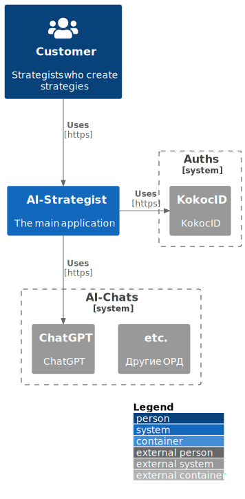

# Архитектура AIST

> **ПАМЯТКА** (для редакторов этого документа)
>
> Дока C4 составлялась по мотивам:\
> https://github.com/plantuml-stdlib/C4-PlantUML
>
> Иконки можно отсюда брать и переносить в локальный кэш:
> https://github.com/tupadr3/plantuml-icon-font-sprites/tree/main/icons/

# Обзор

С4 диаграмма - место сервиса в мире

# Контейнеры

Внутри сервис состоит из частей:

  | Имя на C4 диаграмме | Имя Docker service | Описание                                      |
  |---------------------|--------------------|-----------------------------------------------|
  | Nginx               | nginx              | front reverse proxy (with ssl support)        |
  | Nginx               | static             | nginx with static files of the django app     |
  | SPA                 | frontend           | react NextJS webserver for frontend           |
  | API                 | app                | backend django app                            |
  | Database            | db                 | database (postgresql)                         |
  | RabbitMQ            | rabbit             | message broker (rabbitmq)                     |
  | Celery.Beat         | celery_beat        | scheduler for periodic tasks (the django app) |
  | Celery.Worker       | celery_worker      | async task worker (the django app)            |
  | Celery.Flower       | celery_flower      | web UI for monitoring celery tasks            |

 
